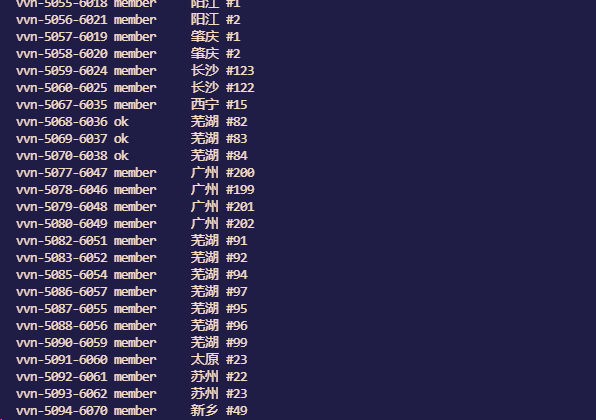

## 免责声明


1. 本工具仅面向 合法授权 的企业安全建设行为与个人学习行为，如您需要测试本工具的可用性，请自行搭建靶机环境。
2. 如您在使用本工具的过程中存在任何非法行为，您需自行承担相应后果，我们将不承担任何法律及连带责任。 在安装并使用本工具前，请您 务必审慎阅读、充分理解各条款内容限制、免责条款或者其他涉及您重大权益的条款可能会以 加粗、加下划线等形式提示您重点注意。 除非您已充分阅读、完全理解并接受本协议所有条款，否则，请您不要安装并使用本工具。您的使用行为或者您以其他任何明示或者默示方式表示接受本协议的，即视为您已阅读并同意本协议的约束。

# 一、简介

python 调用爱加速 linux 版本。使用本项目需要注意：

1、本项目本地环境运行

2、在切换IP后远程容易掉线，经测试vps通过内网IP或流量隧道连接等不受此影响

# 二、安装

参考: https://www.91ajs.com/Help/Tutorial#linux-tab

到官网下载最新版本

## 1、爱加速 Linux安装

```
root@test:~# wget https://www.91ajs.com/files/downloads/linux/ajiasu-x86_64-4.1.1.0.tar.gz
```

解压爱加速软件包：ajiasu-x86_64-4.1.1.0.tar.gz，解压后将得到一个名为 ajiasu 的可执行文件。

```
root@test:~# tar zvxf ajiasu-x86_64-4.1.1.0.tar.gz
ajiasu
root@test:~# cp ajiasu /usr/local/bin/ajiasu
```


## 2、如何查看帮助

使用命令 `./ajiasu -h` 查看帮助


## 3、与服务器连接的示例

1、在 **/etc** 目录下创建一个名为 **ajiasu.conf** 配置文件，填写爱加速的用户名与密码参数。

```
root@test:~# cat /etc/ajiasu.conf
user YOUR_USERNAME
pass YOUR_PASSWORD
```


2、登录：执行命令 `./ajiasu login` 进行登录


3、执行`./ajiasu list` 命令查看可以连接的节点列表


4、使用 `./ajiasu connect`连接节点，注意节点ID或名称需要使用引号括起来。

方法1：根据节点名称进行连接，输入命令：`./ajiasu connect "枣庄 #1"`

方法2：根据节点ID进行连接，输入命令：`./ajiasu connect "vvn-2466-1878"`

最后，根据需要选择协议类型：`udp、tcp、lwip、proxy`，即可成功连接。


# 三、脚本运行

由于linux 版本的`ajiasu`运行起来会阻塞进程，因此使用 pyhon 编写一个调用的linux版本的程序，然后使用另外一个脚本去调用这个进程，并即时更换节点

```
.
├── debug
│   ├── Aijiasu_Agent_Pool.py
│   └── another_script.py
├── dev
│   ├── Aijiasu_Agent_Pool.py
│   ├── another_script.py
│   └── nodeid_success.log
└── speed
    ├── Aijiasu_Agent_Pool.py
    ├── another_script.py
    ├── get_available_nodes.log
    └── log
        └── nodeid_success.log
```

## Debug

`another_script`配置

```
AJIASU_PATH = "/usr/local/bin/ajiasu"  # 指定ajiasu的路径
PROTOCOL_INPUT_TEXT = b"proxy\n"  # 定义协议类型，\n是必须的相当于输入proxy后的回车确认
```

运行

```
root@test:aijiasu# cd debug
root@test:debug# python3 another_script.py
```


运行之后就会挂起进程，这与直接使用linux程序`ajiasu `没什么区别，只是稍稍自动化了一些，哈哈

```
root@test:debug# python3 Aijiasu_Agent_Pool.py
```

debug目录下是不做任何处理，暴力一些，`another_script.py`启动一个ajiasu，使用`Aijiasu_Agent_Pool.py`测试随机代理

```
root@test:debug# python3 Aijiasu_Agent_Pool.py

调用另一个 Python 脚本成功
所有节点已写入: log/get_available_nodes.log
连接命令: /usr/local/bin/ajiasu connect vvn-5070-6038
当前服务器 IP 地址: 124.226.223.252

调用另一个 Python 脚本成功
所有节点已写入: log/get_available_nodes.log
连接命令: /usr/local/bin/ajiasu connect vvn-4665-6894
连接错误: SOCKSHTTPSConnectionPool(host='ip.sb', port=443): Max retries exceeded with url: / (Caused by NewConnectionError('<urllib3.contrib.socks.SOCKSHTTPSConnection object at 0x7f7837ff39d0>: Failed to establish a new connection: Connection closed unexpectedly'))
获取服务器 IP 地址失败，等待重试...

调用另一个 Python 脚本成功
所有节点已写入: log/get_available_nodes.log
连接命令: /usr/local/bin/ajiasu connect vvn-4578-4776
代理连接失败：服务器不可用于用户组。
已连接至节点：vvn-4578-4776
连接错误: SOCKSHTTPSConnectionPool(host='ip.sb', port=443): Max retries exceeded with url: / (Caused by NewConnectionError('<urllib3.contrib.socks.SOCKSHTTPSConnection object at 0x7f7837ffd6d0>: Failed to establish a new connection: Connection closed unexpectedly'))
获取服务器 IP 地址失败，等待重试...

调用另一个 Python 脚本成功
所有节点已写入: log/get_available_nodes.log
连接命令: /usr/local/bin/ajiasu connect vvn-4578-4785
代理连接失败：服务器不可用于用户组。
已连接至节点：vvn-4578-4785
当前服务器 IP 地址: 120.204.204.188
```

一般来说仅仅使用Debug就行了，`Aijiasu_Agent_Pool.py`相当与示例文件，你需要通过阅读这个代码，来为自己的项目添砖加瓦。

---

**二次处理-纯测试**

前面知道，尽管脚本已经筛选出状态为OK的节点了，但仍存在一些无法使用的节点，因此需要对节点进行二次筛选。

## Speed

首选需要取出测试的节点，有两种方法。

方案一：直接使用所有节点，这里使用linux 版本的`ajiasu` 生成，数量较多

```
root@test:aijiasu# /usr/local/bin/ajiasu list
```



方案二：使用`Debug/another_script.py`运行筛选出节点状态为`OK`的`log/get_available_nodes.log`文件，我这里用的就是这个，毕竟已经经过初次筛选了


开始检测

```
root@test:aijiasu# cp debug/log/get_available_nodes.log ./speed/
root@test:aijiasu# cd speed

root@test:speed# python3 aijiasu_Agent_Pool.py -f get_available_nodes.log 
Read file: get_available_nodes.log

调用另一个 Python 脚本成功
Nodeid success write file: log/nodeid_success.log
连接命令: /usr/local/bin/ajiasu connect vvn-2076-264
当前服务器 IP 地址: 222.186.57.63

调用另一个 Python 脚本成功
Nodeid success write file: log/nodeid_success.log
连接命令: /usr/local/bin/ajiasu connect vvn-2081-23
连接错误: SOCKSHTTPSConnectionPool(host='api.ipify.org', port=443): Max retries exceeded with url: /?format=json (Caused by NewConnectionError('<urllib3.contrib.socks.SOCKSHTTPSConnection object at 0x7f90d4c858d0>: Failed to establish a new connection: Connection closed unexpectedly'))
获取服务器 IP 地址失败，等待重试...

调用另一个 Python 脚本成功
Nodeid success write file: log/nodeid_success.log
连接命令: /usr/local/bin/ajiasu connect vvn-3632-5804
当前服务器 IP 地址: 119.188.113.116
```

等待结果


## Dev

根据筛选出的节点组成代理池

```
root@test:aijiasu# cd dev
root@test:dev# python3 Aijiasu_Agent_Pool.py -f nodeid_success.log
Read file: nodeid_success.log

调用另一个 Python 脚本成功
连接命令: /usr/local/bin/ajiasu connect vvn-3632-5804
当前服务器 IP 地址: 119.188.113.116

调用另一个 Python 脚本成功
连接命令: /usr/local/bin/ajiasu connect vvn-3632-5804
连接错误: SOCKSHTTPSConnectionPool(host='api.ipify.org', port=443): Max retries exceeded with url: /?format=json (Caused by NewConnectionError('<urllib3.contrib.socks.SOCKSHTTPSConnection object at 0x7f7887149b10>: Failed to establish a new connection: Connection closed unexpectedly'))
获取服务器 IP 地址失败，等待重试...

调用另一个 Python 脚本成功
连接命令: /usr/local/bin/ajiasu connect vvn-2076-264
当前服务器 IP 地址: 222.186.57.63

调用另一个 Python 脚本成功
连接命令: /usr/local/bin/ajiasu connect vvn-2076-264

连接错误: SOCKSHTTPSConnectionPool(host='api.ipify.org', port=443): Max retries exceeded with url: /?format=json (Caused by NewConnectionError('<urllib3.contrib.socks.SOCKSHTTPSConnection object at 0x7f7887154610>: Failed to establish a new connection: Connection closed unexpectedly'))
获取服务器 IP 地址失败，等待重试...

调用另一个 Python 脚本成功
连接命令: /usr/local/bin/ajiasu connect vvn-2076-264
当前服务器 IP 地址: 222.186.57.63
```

好吧，尽管节点可以用，但仍然有一些连接错误。恰在此时，想起来在`another_script.py`中已经写过判断节点能否使用的代码了，这里的报错是测试站点的问题，因此使用`Debug`内的代码就好。

```
    if "ajiasu stopped. failure" in output:
        print("代理连接失败：服务器不可用于用户组。")
    elif "ajiasu done" in output:
        print("代理连接成功。")
    else:
        print("未知的代理连接状态。")
```

一种植物，脑抽了

# 四、后续

这个代码虽然看起来很拉，但其实没有一点不拉的。

最初的想法是使用爱加速作为代理池，但貌似只能手动切换单个节点，而Github也没有相关的项目，所以只能自己手搓一个了。官方没有提供API，测试了windows、android和linux三个版本，只有linux下有操作空间。

接下来说说代码整体思路吧，也方便大佬读后有感搓个更好的，到时希望让小弟有机会`Fork`一下。

**第一步:** 实现 linux程序的基本功能（`another_script.py`）

```
1、读取节点列表
2、随机取出节点id
3、连接该节点
```

跟linux版本一样存在两个问题

- 1、如果节点可用的话，程序就会停止(被阻塞非终止)

- 2、一次只能选择一个节点

**第二步:** 实现代理池功能（`Aijiasu_Agent_Pool.py`）

```
以下三步无限循环
1、运行another_script.py，随机选择一个节点启动socks代理，以达到每次运行的节点都不同
2、60秒后请求 ip.sb 获取服务器IP，以验证上一步是否启动成功。延时是为了给代理启动的时间
3、终止之前的子进程，结束本次循环
```

改进空间------思路碎片

```
1、使用其他语言实现相应功能，bash、go、rust？
2、程序运行使用nohup？
3、想办法获取请求接口？我看刑, 下一个下一个。
```

